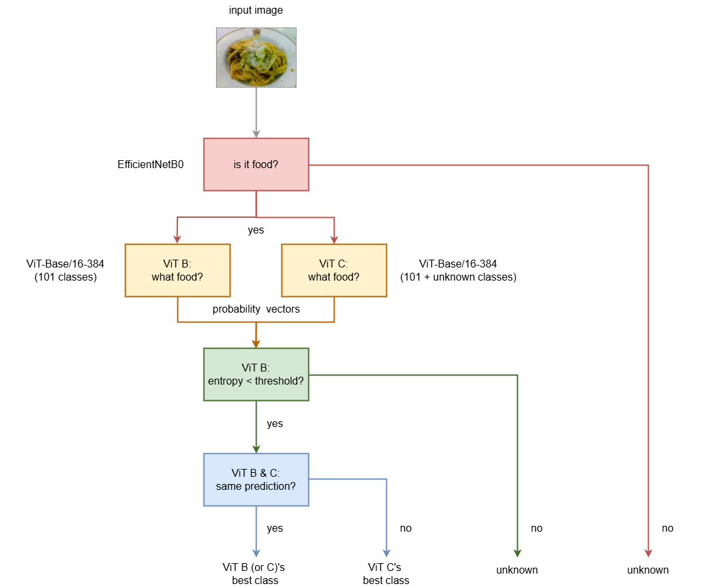

  

# Implementing Vision Transformers (ViT) for Multi-class Image Classification

## 1. Author

[Sergio Sanz](https://www.linkedin.com/in/sergio-sanz-rodriguez/)

## 1. Overview

This project focuses on the implementation, testing, and evaluation of **Vision Transformer (ViT)** models using PyTorch. The architecture is based on the groundbreaking paper titled ["An Image is Worth 16x16 Words: Transformers for Image Recognition at Scale"](https://arxiv.org/abs/2010.11929) (see above Figure), which introduced the application of transformers—originally developed for Natural Language Processing (NLP)—to computer vision.

The primary objective is to assess the accuracy and performance of ViT models using the [Food-101](https://data.vision.ee.ethz.ch/cvl/datasets_extra/food-101/) dataset, which consists of 101 food categories. Additionally, a web application showcasing the selected model has been developed to demonstrate its practical use in real-world scenarios.

## 2. Web Application

The following web app has been created on Hugging Face to showcase the ViT model in action. Feel free to try it out!

https://huggingface.co/spaces/sergio-sanz-rodriguez/transform-eats

## 3. Description of the ViT Architecture

A ViT is a state-of-the-art neural network that utilizes the attention mechanism as its primary learning layer. It divides an image into square patches and establishes relationships between them by identifying the most relevant regions based on contextual information. The multi-head attention mechanism processes these patches and generates a sequence of vectors, each representing a patch along with its contextual features.

These vectors are then passed through a series of non-linear multilayer perceptrons (MLPs), which further extract complex relationships between the patches, enabling the model to understand and analyze the image at a high level. 

One of the outputs of the transformer encoder, typically the representation of the classification token (a special token added to the input sequence), is passed to a simple neural network (often a single-layer classifier) that determines the class to which the input image belongs.

  

Within the scope of this project, different ViT model architecutes have been implemented from scratch and evaluated.

## 4. Proposed Model Architectures

The classification system includes two deep learning approaches: ViT Lite and ViT Pro. The first approach is able to make faster prediction and still reliable predictions, whereas the second one makes more accurate predictions at the expense of longer computation time.

### 4.1. ⚡ ViT Lite ⚡ 

The ViT Lite architecture is illustrated in the figure below. The process begins with an **EfficientNetB0** classifier, which determines whether the input image depicts food or non-food. If the image is classified as food, it is passed to a second deep learning model, a **ViT-Base/16-384** network. This network is also referred to as **Model B** for simplicity.

This model resizes images to **384×384 pixels**, divides them into **16×16 patches**, and classifies them into 101 food categories. To handle uncertain predictions, the approach calculates the entropy of the probability vector produced by the ViT model. High entropy indicates uncertainty, and such images are classified as unknown.

  

### 4.2. 💎 ViT Pro 💎

This advanced ViT architecture builds upon the same EfficientNetB0 and ViT-Base/16-384 algorithms, integrating an additional ViT network to enhance prediction accuracy. The additional network, also a ViT-Base/16-384, is designed to recognize the same 101 food types along with an extra category labeled "unknown". This network is also named **"Model C"** for simplicity.

If both classifiers agree on the top-class prediction, it is highly likely that the food depicted in the image corresponds to that category. In cases of discrepancy, the output from the third model, which incorporates enriched information, is used. This approach ensures that the architecture avoids incorrect classifications by the first model, particularly for images that do not belong to any of the supported categories, as the first model lacks the "unknown" class.

  

## 5.Model Performance

**Binary classifier (Food vs Non-Food):**
* Model architecture: EfficientNetB0
* Model size: 16 MB
* Number of parameters: 4.0 million
* ROC AUC score: 1.0
* Recall at 0% false positive rate: 99.3%
* Training time (RTX 4070): ~4 min/epoch

  

As observed, the binary classification model achieves near perfect prediction.

**Food classifier:**
| Parameter | EffNet A | EffNet B | ViT A | ViT B | ViT C |
| ----- | ----- | ----- | ----- | ----- | ----- | 
| Model architecture | EfficientNetB2 | EfficientNetV2L | ViT-Base/16 | ViT-Base/16 | ViT-Base/16 |
| Input image size | 288x288 pixels | 480x480 pixels | 224x224 pixels | 384x384 pixels | 384x384 pixels |
| Number of classes | 101 | 101 | 101 | 101 | 101 + "unknown" |
| Model size | 37 MB | 461 MB | 327 MB | 328 MB | 328 MB |
| Number of parameters | 9.2 million | 117.4 million | 85.9 million | 86.2 million | 86.2 million |
| Accuracy | 88.0% | 92.9% | 87.7% | 91.6% | 91.0% |
| Performance on CPU (Core i9-9900K) | 16.7 image/sec | 1.4 images/sec | 9.1 images/sec | 3.2 images/sec | 3.2 images/sec |
| Performance on GPU (RTX 4070) | 20 images/sec | 3.6 images/sec | 50 images/sec | 50 images/sec | 50 images/sec |
| Training time (RTX 4070) | ~8 min/epoch | ~94 min/epoch | ~8 min/epoch | ~18 min/epoch | ~20 min/epoch |
 

The above table shows a comparison between different deep learning architectures. As observed, ViT-Base/16-224 achieves an accuracy comparable to EfficientNetB2, but the latter predicts almost twice as fast on the CPU, although not on the GPU. This indicates that the ViT model is highly optimized for GPU devices. We can also observe that EfficientNetV2L achieves the highest accuracy (92.9%), followed very closely by ViT-Base/16-384 (91.6%). However, EfficientNetV2L is about twice as slow on the CPU and significantly slower on the GPU.

Therefore, **`ViT-Base/16-384`** is the model that achieves the best trade-off between accuracy and prediction speed.

  

This figure illustrates the F1-Score per class obtained by ViT-Base/16-384.

## 5. Description of the Notebooks

* [Custom_Data_Creation.ipynb](https://github.com/sergio-sanz-rodriguez/Vision-Transformers-Image-Classification/blob/main/notebooks/Custom_Data_Creation.ipynb): This notebook downloads and creates the image dataset for the food classifier network, splitting the data into train and test subsets.
* [Custom_Data_Creation_Classification.ipynb](https://github.com/sergio-sanz-rodriguez/Vision-Transformers-Image-Classification/blob/main/notebooks/Custom_Data_Creation_Classification.ipynb): This notebook downloads and creates the image dataset for the binary classification network, splitting the data into train and test subsets.
* [Binary_Classification_Modeling.ipynb](https://github.com/sergio-sanz-rodriguez/Vision-Transformers-Image-Classification/blob/main/notebooks/Binary_Classification_Modeling.ipynb): It implements a binary classification model to distinguish between food and non-food images, using the simple EfficientNetB0 architecture.
* [EfficientNetB2_Modeling.ipynb](https://github.com/sergio-sanz-rodriguez/Vision-Transformers-Image-Classification/blob/main/notebooks/EfficientNetB2_Modeling.ipynb): In this notebook, an EfficientNetB2 Convolutional Neural Network (CNN) is trained for different combinations of parameters, such as batch size, hidden units, and number of epochs.
* [EfficientNetV2L_Modeling.ipynb](https://github.com/sergio-sanz-rodriguez/Vision-Transformers-Image-Classification/blob/main/notebooks/EfficientNetV2L_Modeling.ipynb): In this notebook, an EfficientNetV2L CNN is trained for different combinations of parameters, such as batch size, hidden units, and number of epochs.
* [ViT_Modeling_v1.ipynb](https://github.com/sergio-sanz-rodriguez/Vision-Transformers-Image-Classification/blob/main/notebooks/ViT_Modeling_v1.ipynb): This notebook outlines the creation, compilation, and training of multiple ViT-Base and ViT-Large networks, by applying both transfer learning and regular learning of the whole backbones. Several training configurations have been tested in order to find the optimal tunning for these architectures.
* [ViT_Modeling_v2.ipynb](https://github.com/sergio-sanz-rodriguez/Vision-Transformers-Image-Classification/blob/main/notebooks/ViT_Modeling_v2.ipynb): It includes more ViT-Base models trained with an input image size of 384x384 pixels instead of 224x224 pixels, which require other non-default pretrained weights, particularly [ViT_B_16_Weights.IMAGENET1K_SWAG_E2E_V1](https://pytorch.org/vision/main/models/generated/torchvision.models.vit_b_16.html#torchvision.models.vit_b_16).
* [ViT_Modeling_v3.ipynb](https://github.com/sergio-sanz-rodriguez/Vision-Transformers-Image-Classification/blob/main/notebooks/ViT_Modeling_v3.ipynb): It includes more ViT-Base models trained with 102 classes, the 101 original ones plus another called "unknown", and using an input image size of 384x384 pixels instead of 224x224 pixels, which require other non-default pretrained weights, particularly [ViT_B_16_Weights.IMAGENET1K_SWAG_E2E_V1](https://pytorch.org/vision/main/models/generated/torchvision.models.vit_b_16.html#torchvision.models.vit_b_16).
* [EfficientNetB2_Evaluation.ipynb](https://github.com/sergio-sanz-rodriguez/Vision-Transformers-Image-Classification/blob/main/notebooks/EfficientNetB2_Evaluation.ipynb): This notebook mainly focuses on evaluating the model obtained from the EfficientNetB2_Modeling.ipynb notebook. The evaluation metrics used include: accuracy, false positive rate at 95% recall, prediction time on the CPU and GPU, model size, and number of parameters.
* [EfficientNetV2L_Evaluation.ipynb](https://github.com/sergio-sanz-rodriguez/Vision-Transformers-Image-Classification/blob/main/notebooks/EfficientNetV2L_Evaluation.ipynb): This notebook mainly focuses on evaluating the model obtained from the EfficientNetV2L_Modeling.ipynb notebook. The evaluation metrics used include: accuracy, false positive rate at 95% recall, prediction time on the CPU and GPU, model size, and number of parameters.
* [ViT_Evaluation_v1.ipynb](https://github.com/sergio-sanz-rodriguez/Vision-Transformers-Image-Classification/blob/main/notebooks/ViT_Evaluation_v1.ipynb): This notebook mainly focuses on evaluating the best performing ViT model obtained from the ViT_Modeling_v1.ipynb notebook. The evaluation metrics used include: accuracy, false positive rate at 95% recall, prediction time on the CPU and GPU, model size, and number of parameters.
* [ViT_Evaluation_v2.ipynb](https://github.com/sergio-sanz-rodriguez/Vision-Transformers-Image-Classification/blob/main/notebooks/ViT_Evaluation_v2.ipynb): This notebook mainly focuses on evaluating the best performing ViT model obtained from the ViT_Modeling_v2.ipynb notebook. The evaluation metrics used include: accuracy, false positive rate at 95% recall, prediction time on the CPU and GPU, model size, and number of parameters.
* [ViT_Evaluation_v3.ipynb](https://github.com/sergio-sanz-rodriguez/Vision-Transformers-Image-Classification/blob/main/notebooks/ViT_Evaluation_v3.ipynb): This notebook mainly focuses on evaluating the best performing ViT model obtained from the ViT_Modeling_v3.ipynb notebook. The evaluation metrics used include: accuracy, false positive rate at 95% recall, prediction time on the CPU and GPU, model size, and number of parameters.
* [Model_Deployment.ipynb](https://github.com/sergio-sanz-rodriguez/Vision-Transformers-Image-Classification/blob/main/notebooks/Model_Deployment.ipynb): This notebook generates the necessary files and graphical user interface for the web application to be hosted on Hugging Face. The Gradio framework is used to showcase the performance of the transformer network.
* [Model_Deployment_v2.ipynb](https://github.com/sergio-sanz-rodriguez/Vision-Transformers-Image-Classification/blob/main/notebooks/Model_Deployment_v2.ipynb): This notebook adds a binary classification model to the app, designed to distinguish between food and non-food images.
* [Model_Deployment_v3.ipynb](https://github.com/sergio-sanz-rodriguez/Vision-Transformers-Image-Classification/blob/main/notebooks/Model_Deployment_v3.ipynb): This notebook replaces the food classification model with another one with higher prediction accuracy, but at the cost of slower predictions. This new ViT model analyses images of 384x384 pixels, instead of 224x224 pixels.
* [Model_Deployment_v4.ipynb](https://github.com/sergio-sanz-rodriguez/Vision-Transformers-Image-Classification/blob/main/notebooks/Model_Deployment_v4.ipynb): This notebook updates the app to use a new ViT-Base/16-384 model trained with 102 (110 + "unknown") classes (see [ViT_Modeling_v3.ipynb](https://github.com/sergio-sanz-rodriguez/Vision-Transformers-Image-Classification/blob/main/notebooks/ViT_Modeling_v3.ipynb)). This network analyses images of 384x384 pixels, instead of 224x224 pixels.
* [vision_transformer.py](https://github.com/sergio-sanz-rodriguez/Vision-Transformers-Image-Classification/blob/main/notebooks/modules/vision_transformer.py): Implementation of the ViT architecture describe in the paper titled ["An Image is Worth 16x16 Words: Transformers for Image Recognition at Scale"](https://arxiv.org/abs/2010.11929). Two classes are implemented: 
    * `ViT`: original ViT architecture as described in the paper
    * `ViTv2`: identical to ViT except that the classification head can be passed as an argument, allowing for customization of the number of hidden layers and units per layer. Even it is also possible to pass a list of classification heads and stacking them by averaging.
* [engine.py](https://github.com/sergio-sanz-rodriguez/Vision-Transformers-Image-Classification/blob/main/notebooks/modules/engine.py): Contains functions to handle the training, validation, and inference processes of a neural network.
* [helper_functions.py](https://github.com/sergio-sanz-rodriguez/Vision-Transformers-Image-Classification/blob/main/notebooks/modules/helper_functions.py): Provides utility functions for analysis, visualization, and reading/writing PyTorch neural networks.
* [scheduler.py](https://github.com/sergio-sanz-rodriguez/Vision-Transformers-Image-Classification/blob/main/notebooks/modules/scheduler.py): A collection of custome learning rate schedulers. Some classes have been taken from [kamrulhasanrony](https://github.com/kamrulhasanrony/Vision-Transformer-based-Food-Classification/tree/master). Many thanks!
